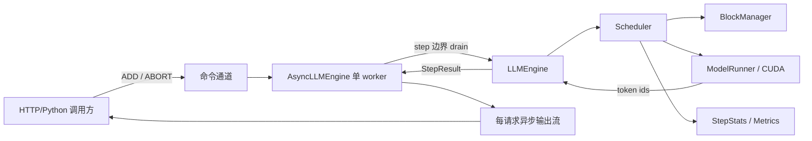
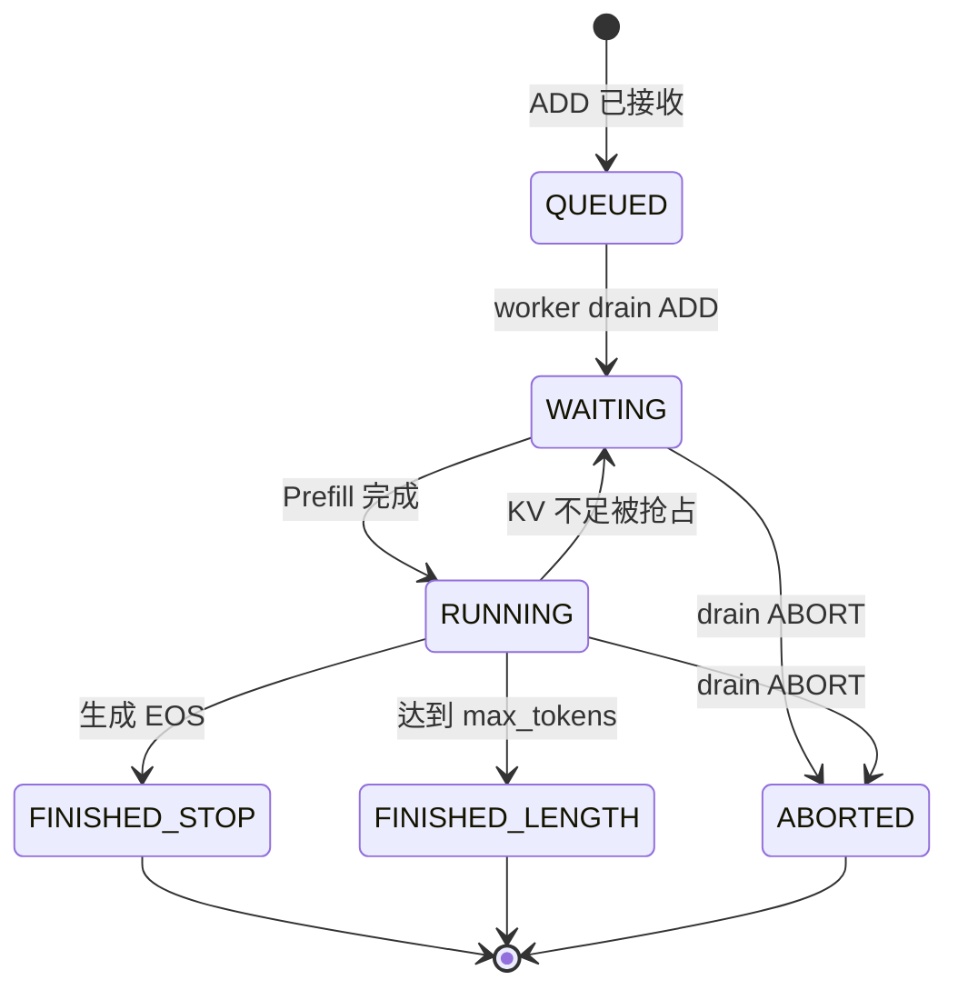
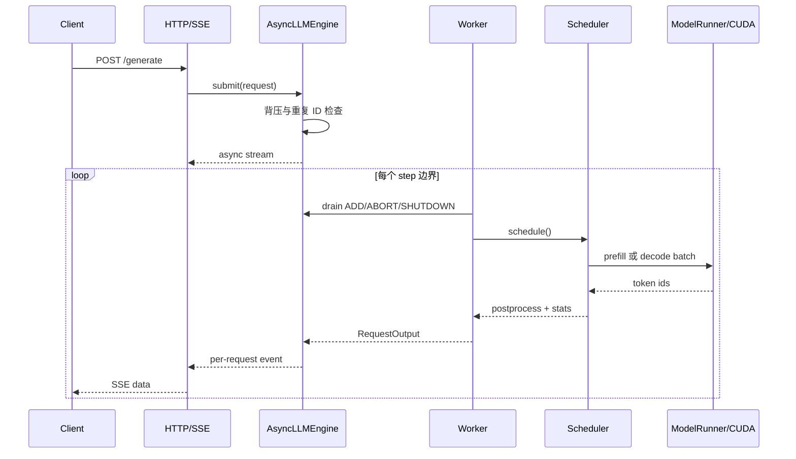

# Nano-vLLM 在线调度器开发文档

> **状态标签**：`Implemented`（在线调度） · `CPU Verified`（46 tests passed） · `GPU Verified`（RTX 4060 三策略 × 5 次重复；[证据](../../reports/nanovllm-online-rtx4060-20260828.md)）
>
> **证据基线**：`bb823b3`　|　**文档日期**：2026-08-22　|　**目标阶段**：单机在线调度可复现实验版

本文保留 2026-08-22 的设计基线；后续 GPU 结果与当前证据状态以上述报告和公开证据包为准。

## 1. 项目目标与证据边界

本阶段把 Nano-vLLM 的“批量提交后一次性返回”扩展为“请求可在线进入、逐 token 输出、可取消、可观测”的单机实验型推理服务。重点不是宣称性能领先，而是完整解释请求怎样进入调度队列、怎样在 Prefill/Decode 间选择、怎样占用和释放 KV Cache，以及怎样形成可复现实验记录。

状态词只允许以下三种含义：

| 标签 | 含义 | 当前可使用范围 |
|---|---|---|
| `Implemented` | 在当前检出代码中存在，可定位到具体实现 | 基线能力与当前工作树在线扩展 |
| `CPU Verified` | 已在无 CUDA 路径运行测试并保存通过证据 | `python -m pytest -q`：46 passed，2026-08-22 |
| `GPU Pending` | 设计或代码可能存在，但尚无 RTX 4060 原始运行数据 | 所有在线调度性能、显存和延迟结论 |

禁止把代码存在写成性能已验证，也禁止把上游 README 的 RTX 4070 Laptop 数据写成本人 RTX 4060 结果。

## 2. 上游能力与本阶段边界

### 2.1 基线已实现

- `LLMEngine.generate()`：批量添加请求，循环调用 `step()`，完成后按 `seq_id` 排序返回。
- `Scheduler.waiting/running`：分别维护等待 Prefill 和正在 Decode 的序列。
- `Scheduler.schedule()`：基线固定 Prefill 优先；无 Prefill 批次时才调度 Decode。
- Chunked Prefill：一个长请求可被 `max_num_batched_tokens` 切成多步，但每步只允许第一个序列切块。
- `BlockManager`：KV Block 分配、引用计数、释放、完整块哈希和 Prefix Cache 复用。
- 显存不足时的抢占：Decode 无法追加块时，释放一个运行序列并放回等待队列，之后重新 Prefill。
- 模型执行：FlashAttention、Paged KV Cache、Tensor Parallel、CUDA Graph 和采样。

### 2.2 当前工作树新增（Implemented / CPU Verified）

- 三种策略：`prefill_first`、`decode_first`、`bounded_decode_first`。
- 有界 Decode：连续 Decode 最多 `max_consecutive_decode_steps` 步，随后强制一次可执行 Prefill。
- 请求 API：自定义 `request_id`、逐步输出、主动取消、重复 ID 拒绝。
- 异步引擎：单 worker 线程独占 CUDA；调用方只提交命令和消费事件。
- 背压：Scheduler 的 `waiting + running` 活跃请求总数达到 `max_queue_size` 后拒绝新请求；该值不限制内部 `_commands` 队列。
- SSE 服务：生成、取消、健康检查、指标四个端点。
- 可观测性：每步记录批次类型、队列长度、KV Block、抢占、强制 Prefill 与耗时。

明确不在本阶段：多机调度、跨进程 API worker、请求持久化、鉴权计费、动态模型加载、生产级限流、正式 GPU 性能结论。

## 3. 总体架构



单 worker 是核心约束：CUDA 上下文、`Scheduler`、`BlockManager` 和模型状态只允许 worker 线程修改。HTTP handler 不直接调用 CUDA，也不直接改 `waiting/running`。

## 4. 核心对象与职责

| 对象 | 状态 | 职责 |
|---|---|---|
| `Config` | `Implemented / CPU Verified` | 模型和调度上限；校验策略、连续 Decode 上限、活跃请求容量 |
| `Sequence` | `Implemented` | token、状态、采样参数、KV Block 表和完成长度 |
| `Scheduler` | `Implemented / CPU Verified` | 从 waiting/running 选择批次、抢占、后处理、释放 KV |
| `BlockManager` | `Implemented` | KV Block 生命周期与 Prefix Cache |
| `LLMEngine` | `Implemented / CPU Verified` | 请求 ID 映射、执行一步、生成 `RequestOutput/StepStats` |
| `AsyncLLMEngine` | `Implemented / CPU Verified` | 命令 drain、单 worker、每请求异步流、异常广播和关闭 |
| HTTP/SSE 层 | `GPU Verified` | FastAPI 参数校验、状态码映射、SSE 编码、健康和 JSON 指标；RTX 4060 正式实验已端到端运行 |

本阶段不引入数据库。所有请求状态都是进程内状态，进程退出即丢失。

## 5. 数据结构契约

### 5.1 `RequestOutput`

| 字段 | 类型 | 语义 |
|---|---|---|
| `request_id` | `str` | 外部稳定 ID；由调用方提供或引擎生成 |
| `sequence_id` | `int` | 引擎内部单调序列 ID |
| `token_id` | `int \| None` | 本步新 token；abort 终态可以为空 |
| `token_ids` | `tuple[int, ...]` | 截至本步的累计输出 token，不可变快照 |
| `text` | `str` | 截至本步的累计解码文本 |
| `finished` | `bool` | 此事件后是否进入终态 |
| `finish_reason` | `stop \| length \| abort \| None` | 未完成时为空；完成时必须有值 |
| `timestamp_ns` | `int` | 生成事件时的单调时钟纳秒值 |

### 5.2 `StepStats`

| 字段 | 类型 | 语义 |
|---|---|---|
| `step_id` | `int` | worker 内单调递增的执行步 |
| `batch_kind` | `prefill \| decode \| idle` | 本步批次类型；只有待交付 abort 事件时可出现 idle |
| `batch_size` | `int` | 本步序列数 |
| `scheduled_tokens` | `int` | 本步计划执行的 token 数 |
| `waiting` / `running` | `int` | 后处理后的队列快照 |
| `kv_used_blocks` / `kv_total_blocks` | `int` | KV Block 使用量与总量 |
| `preemptions` | `int` | 本步发生的抢占次数 |
| `forced_prefill` | `bool` | 是否因有界 Decode 上限而强制 Prefill |
| `allocation_blocked` | `bool` | 是否遇到 KV 分配阻塞 |
| `elapsed_ms` | `float` | 本步墙钟耗时；不是请求 E2E |
| `scheduled_request_ids` | `tuple[str, ...]` | 本步被选中的外部请求 ID |
| `preempted_request_ids` | `tuple[str, ...]` | 本步实际被抢占的请求 ID |
| `waiting_request_ids` / `running_request_ids` | `tuple[str, ...]` | 后处理后的队列成员快照 |
| `waiting_before` / `running_before` | `int` | 调度前队列长度 |
| `decode_streak` | `int` | 本步后的连续 Decode 计数 |

`StepResult` 是不可变 dataclass，聚合 `outputs: tuple[RequestOutput, ...]` 与 `stats: StepStats | None`；当前活跃引擎步都会生成统计。

## 6. 调度策略

| 策略 | 选择规则 | 优点 | 风险 |
|---|---|---|---|
| `prefill_first` | waiting 中存在可执行 Prefill 时优先 Prefill | 吞吐友好，保持上游行为 | 活跃 Decode 可能被新请求持续推迟 |
| `decode_first` | running 中存在可执行 Decode 时优先 Decode | 降低在途请求 TPOT 抖动 | 新请求 TTFT 可能饥饿 |
| `bounded_decode_first` | 优先 Decode；连续达到上限且有 waiting 时强制 Prefill | 在 TTFT 与 TPOT 间建立可解释边界 | 多一个状态计数和边界条件 |

`Config` 为兼容上游默认 `scheduler_policy="prefill_first"`；服务 CLI 默认 `bounded_decode_first`，两者的 `max_consecutive_decode_steps` 都是 `8`。这是兼容/演示起点，不是性能最优结论。

```text
调度决策
  ├─ 没有 running → 尝试 Prefill
  ├─ 没有 waiting → 尝试 Decode
  ├─ prefill_first → Prefill
  ├─ decode_first → Decode
  └─ bounded_decode_first
       ├─ consecutive_decode_steps < limit → Decode
       └─ 已达 limit → 强制 Prefill，并把计数归零
```

如果首个 waiting 请求暂时无法分配 KV Block，调度器必须显式记录 `allocation_blocked=true`，不能用空批次或断言掩盖原因。

## 7. 请求生命周期状态机



请求 ID 在单个 engine 生命周期内只允许使用一次：`_known_request_ids` 在请求终态后仍保留 ID。任何曾用 ID 再提交都必须返回冲突，避免消费者混淆旧流与新流。

## 8. 在线请求时序



取消不是 GPU kernel 中断。`DELETE` 进入命令队列，在下一个 step 边界生效；生效后释放 KV Block，并只发布一次 `finish_reason="abort"` 的终态。

## 9. 必须始终成立的不变量

1. 一个 `Sequence` 同一时刻最多属于 `waiting` 或 `running` 中的一个队列。
2. `FINISHED` 或 abort 后的序列不再参与调度，且其 KV Block 最终全部释放。
3. `0 <= kv_used_blocks <= kv_total_blocks`；空闲集合与使用集合不相交。
4. 每个已分配块 `ref_count > 0`；释放到零时从 used 移入 free。
5. `num_cached_tokens + num_scheduled_tokens <= num_tokens`。
6. Decode 每个序列每步只计划一个 token。
7. 每个请求最多一个终态事件，终态后不得再产生 token 事件。
8. 累计 `token_ids` 只能追加；`text` 是同一累计 token 列表的解码结果。
9. `step_id` 单调递增；同一步所有输出引用同一份统计快照。
10. `bounded_decode_first` 在 waiting 可执行时不得超过配置的连续 Decode 上限。
11. 只有 worker 线程可以调用模型、调度器和 BlockManager 的可变操作。
12. `waiting + running` 达到 admission 上限时拒绝新的 ADD，不能静默丢请求；ABORT/SHUTDOWN 必须有明确处理策略。

## 10. 配置契约

| 配置 | 默认值 | 校验 | 影响 |
|---|---:|---|---|
| `max_num_batched_tokens` | `16384` | 正整数 | 单次 Prefill token 预算 |
| `max_num_seqs` | `512` | 正整数 | 单批最大序列数 |
| `max_model_len` | `4096` | 正整数，且受模型上限截断 | 输入加输出长度上限 |
| `gpu_memory_utilization` | `0.9` | `(0, 1]` | KV Cache 预算 |
| `tensor_parallel_size` | `1` | `1..8` | GPU 进程数 |
| `enforce_eager` | `False` | 布尔 | 是否禁用 CUDA Graph |
| `kvcache_block_size` | `256` | 正数且可被 `256` 整除 | KV Block 粒度 |
| `scheduler_policy` | `prefill_first` | 三个枚举值之一 | Prefill/Decode 选择；在线 CLI 默认 bounded |
| `max_consecutive_decode_steps` | `8` | 正整数 | 有界 Decode 上限 |
| `max_queue_size` | `256` | 正整数 | Scheduler `waiting + running` 活跃请求上限 |

当前 `Config` 已将模型路径、批大小、上下文、显存比例、并行度、Block 粒度和调度参数改成显式 `ValueError` 校验；在线服务层再把用户可触发的非法输入映射成确定的 `422`。

## 11. 错误模型

| 场景 | Python 层 | HTTP 层 | 可重试 |
|---|---|---:|---|
| Engine 生命周期内 `request_id` 重复 | 明确冲突异常 | `409` | 更换 ID 后可重试 |
| 参数非法、prompt 为空或过长 | 参数异常 | `422` | 修正请求后可重试 |
| Scheduler 活跃请求总容量满 | 背压异常 | `429` | 退避后可重试 |
| 请求不存在或已终态时取消 | `False` | `404` | 通常无需 |
| 引擎已关闭 | `EngineClosedError` | `503` | 等服务恢复 |
| worker 初始化或运行失败 | 流错误/引擎失败态 | `500` | 需检查服务健康 |
| 正常 EOS / 长度结束 / 取消 | 终态输出 | `200` SSE 终态事件 | 不适用 |

详细请求与响应见 `NANOVLLM_ONLINE_API.md`。

## 12. 测试矩阵

| 层级 | 用例 | CPU | GPU | 验收条件 |
|---|---|---|---|---|
| Config | 三个策略合法；未知策略拒绝；上限为零拒绝 | 必测 | 不需 | 错误确定、消息可读 |
| Scheduler | 三策略选择顺序 | 必测 | 不需 | 批次类型与预期一致 |
| Scheduler | bounded 在上限后强制 Prefill | 必测 | 不需 | `forced_prefill=true`，计数归零 |
| Scheduler | KV 不足抢占、重新入队、最终释放 | 必测 | 可选 | 队列/块不变量成立 |
| Engine | 自生成 ID、自定义 ID、重复 ID | 必测（fake runner） | 冒烟 | ID 稳定，409 映射正确 |
| Engine | token 累计与三种 finish reason | 必测（fake runner） | 冒烟 | 恰好一个终态 |
| Async | 并发 submit、背压、abort、shutdown | 必测（fake engine） | 冒烟 | 无死锁、无跨请求串流 |
| HTTP | 四端点、SSE 事件、断连清理 | 必测（fake engine） | 冒烟 | 状态码和事件 schema 稳定 |
| GPU | Qwen3-0.6B 单请求 | 不适用 | 必测 | 输出完成且原始数据落盘 |
| GPU | 策略 A/B 固定负载 | 不适用 | 必测 | 正确性门禁通过后才比较指标 |

当前 CPU 门禁已通过：`python -m pytest -q` 得到 `46 passed`；Ruff、`python -m compileall -q nanovllm benchmarks tests` 与 `git diff --check` 通过。测试来自 fake runner、延迟导入和纯 CPU 调度/benchmark 测试，不代表模型已在 CPU 或 GPU 完成推理。开发主机使用 Python 3.13 跑纯 CPU 测试；项目声明 `>=3.10,<3.13`，正式 WSL 复现固定用 Python 3.11。

## 13. 开发节点与完成定义

1. **类型与配置**：新增在线输出/统计类型和严格配置校验。
2. **可取消 LLMEngine**：请求 ID 映射、`abort_request()`、`step_stream()`。
3. **策略调度**：三种策略、连续 Decode 计数和统计字段。
4. **异步引擎**：单 worker、命令 drain、有界队列、异常与关闭。
5. **HTTP/SSE**：生成、取消、健康、指标与错误映射。
6. **CPU 测试**：fake runner 覆盖策略、并发和 API，不要求 CUDA。
7. **WSL2 GPU 实验**：固定环境、warmup、重复运行、原始数据和结论。

节点 1～6 的当前工作树代码与 CPU 测试已完成；GPU 节点仍必须有 RTX 4060 原始结果文件才能改变状态。

## 14. 性能与安全记录原则

- 每次 A/B 只改变一个主变量；模型、prompt 集、输出长度、并发、随机种子和软件版本固定。
- 先做输出数量、终态、token 预算、异常率等正确性门禁，再解读 TTFT/TPOT/吞吐。
- 至少 warmup、重复运行并保留每次原始数据；只给均值不构成证据。
- prompt 可能含敏感内容，默认结果 schema 只保存长度和哈希；若保存原文必须显式同意。
- `/metrics` 不应包含 prompt、token 文本或系统路径。
- benchmark 用请求 ID 快照真实累计 `waiting_steps` 与 `preemption_count`；当前没有严格的每请求重算 token 归因，因此 `recomputed_tokens` 必须保持 `null`。
- Barrier interference 在初始 Decode-heavy 请求全部产生首 token 时记录 `barrier_ns`，再以 100 ms 间隔注入长 Prompt，稳定测量 Prefill 对在途 Decode 的干扰。
- 服务只用于本地实验；绑定公网前必须补鉴权、TLS、限流和输入大小保护。

## 15. 交接入口

- 在线接口：`NANOVLLM_ONLINE_API.md`
- 调度实现规范：`NANOVLLM_SCHEDULER_STYLE.md`
- 项目展示与面试话术：`PROJECT_SHOWCASE_ZH.md`
- RTX 4060 实验模板：`EXPERIMENT_REPORT_RTX4060.md`
- 七天实施记录：`DEVELOPMENT_LOG.md`
- WSL2 复现：`WSL2_RTX4060_RUNBOOK.md`
- 原始结果 schema：`results/README.md`
